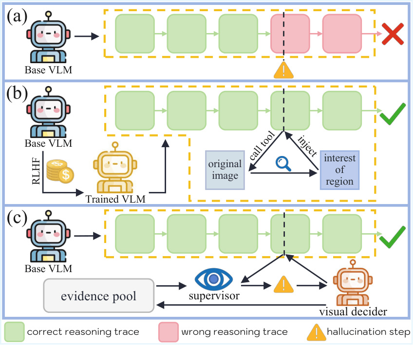
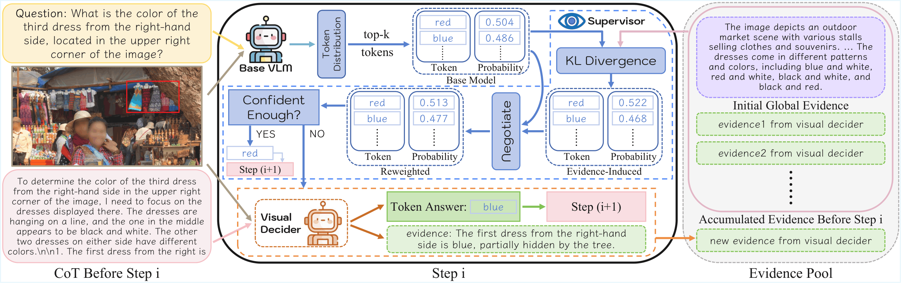

# See It, Say It, Sorted: An Iterative Training-Free Framework for Visually-Grounded Multimodal Reasoning in LVLMs

**Evidence-Constrained Reweighting Decoding (ECRD)** is a lightweight, training-free, plug-and-play decoding framework for visually grounded multimodal reasoning in LVLMs.

<p align="center">
  
</p>

ECRD supervises each decoding step at test time with a textual visual-evidence pool. A distribution supervisor reweights a knee-selected candidate set using evidence-induced preferences. When the reweighted distribution remains uncertain, a lightweight visual decider extracts one additional micro-evidence sentence from the image and appends it to the pool.

<p align="center">
  
</p>

## Highlights

- **Training-free**: no SFT, no RL, no reward model.
- **Plug-and-play**: integrates as a standard HuggingFace `LogitsProcessor`.
- **Backbone-friendly**: tested with Qwen2.5-VL, LLaVA-OneVision, and InternVL-style LVLMs.
- **Dynamic evidence pool**: reuses short textual visual evidence across later reasoning steps.
- **Sparse visual decider calls**: GRIT/Qwen2.5-VL-3B is invoked only when uncertainty persists.

## Repository layout

```text
.
├── ecrd/
│   ├── evidence.py            # Evidence dataclass
│   ├── scorer.py              # Mean-over-prefix textual evidence scorer
│   ├── logits_processor.py    # ECRD distribution supervisor
│   ├── triggers.py            # Mixed-gap uncertainty trigger
│   ├── grit_client.py         # Optional GRIT visual decider wrapper
│   └── prompts.py             # Global evidence prompt
├── examples/
│   └── qwen2_5_vl_ecrd_demo.py
├── assets/                    # Figures extracted from the paper PDF
├── requirements.txt
├── pyproject.toml
└── CITATION.bib
```

## Installation

```bash
git clone https://github.com/uuuuZYC/See-It-Say-It-Sorted.git
cd See-It-Say-It-Sorted
pip install -e .

# For Qwen2.5-VL / GRIT visual-decider examples:
pip install -r requirements.txt
```

> `qwen-vl-utils` is only required for the Qwen2.5-VL demo and `GRITClient`. The core ECRD supervisor (`EvidenceScorer` + `ECRDLogitsProcessor`) only depends on PyTorch and Transformers.

## Minimal API usage

```python
from transformers import LogitsProcessorList
from ecrd import Evidence, EvidenceScorer, ECRDLogitsProcessor, MixedGapTrigger, GRITClient

# 1) Build evidence scorer and add an initial global visual description.
scorer = EvidenceScorer(model=model, tokenizer=tokenizer, max_prefix_len=128)
scorer.add_evidence(Evidence(id="global-0", text=global_description, source="global", time_step=0))

# 2) Attach the ECRD supervisor as a HuggingFace logits processor.
ecrd = ECRDLogitsProcessor(
    scorer=scorer,
    tokenizer=tokenizer,
    min_k=1,
    max_k=64,
)

# 3) Optional: attach a GRIT visual decider for uncertainty-triggered evidence expansion.
grit = GRITClient(model_id="yfan1997/GRIT-20-Qwen2.5-VL-3B")

def grit_hook(image, question, prefix_text, candidates):
    return grit.decide_next_token(
        image=image,
        question=question,
        prefix_text=prefix_text,
        candidates=candidates,
        max_new_tokens=64,
    )

ecrd.set_grit_runtime(
    hook=grit_hook,
    trigger=MixedGapTrigger(gap_thresh=0.08, min_k=2, cooldown=5),
    evidence_pool=scorer,
    question=question,
    image=image_uri,
)

# 4) Generate.
outputs = model.generate(
    **inputs,
    logits_processor=LogitsProcessorList([ecrd]),
    do_sample=False,
    max_new_tokens=512,
)
```

## Qwen2.5-VL quick demo

```bash
python examples/qwen2_5_vl_ecrd_demo.py \
  --model Qwen/Qwen2.5-VL-7B-Instruct \
  --image /path/to/image.jpg \
  --question "What is shown in the image?" \
  --use-grit
```

For LLaVA-OneVision or InternVL, keep the ECRD objects unchanged and replace only the model-specific image/chat preprocessing before `model.generate(...)`.

## Core algorithm components

**EvidenceScorer.** For each textual evidence sentence, ECRD precomputes next-token distributions over sentence prefixes and aggregates them with mean-over-prefix support. Multiple evidences are combined using the scorer's evidence aggregation.

**Distribution supervisor.** At each decoding step, ECRD:

1. computes the base next-token distribution;
2. selects a compact knee top-k candidate set;
3. scores candidates against the evidence pool;
4. mass-matches and mixes the evidence-induced distribution with the base probabilities;
5. triggers a visual decider only if the mixed top-1/top-2 gap remains small.

**Visual decider.** `GRITClient` receives the image, the tail of the current prefix, and the current candidate set. It returns a token choice and a short evidence sentence. The token is forced for the current step and the sentence is appended to the evidence pool.

## Environment knobs

The implementation supports the following optional environment variables:

| Variable | Default | Meaning |
| --- | ---: | --- |
| `ECRD_MIN_K` | `1` | Minimum knee candidate set size |
| `ECRD_MAX_K` | `64` | Maximum knee candidate set size |
| `ECRD_LOGMIX_ALPHA` | `0.6` | Base alpha before adaptive override |
| `ECRD_ALPHA_ADAPT` | `1` | If enabled, uses `alpha = p_top` |
| `ECRD_MIX_REWEIGHT` | `1` | Mass-match evidence distribution to base candidate mass |
| `ECRD_DEBUG` | `0` | Print per-step base/evidence/mixed top tokens |
| `ECRD_DEBUG_TOP` | `10` | Number of debug tokens to print |

## Notes

- The implementation in this repository is intentionally minimal and excludes Ocean-R1/RH-Bench steering code, dataset conversion scripts, cached experimental runs, and other project-specific utilities.
- ECRD is a decoding-time method; it does not change LVLM parameters.
- The optional GRIT visual decider is Qwen2.5-VL-specific; the distribution supervisor itself is a generic Transformers logits processor.

## Citation

```bibtex
@inproceedings{zhang2026see,
  title={See It, Say It, Sorted: An Iterative Training-Free Framework for Visually-Grounded Multimodal Reasoning in LVLMs},
  author={Zhang, Yongchang and Ma, Oliver and Liu, Tianyi and Zhou, Guangquan and Chen, Yang},
  booktitle={Proceedings of the IEEE/CVF Conference on Computer Vision and Pattern Recognition},
  pages={11933--11942},
  year={2026}
}
```
